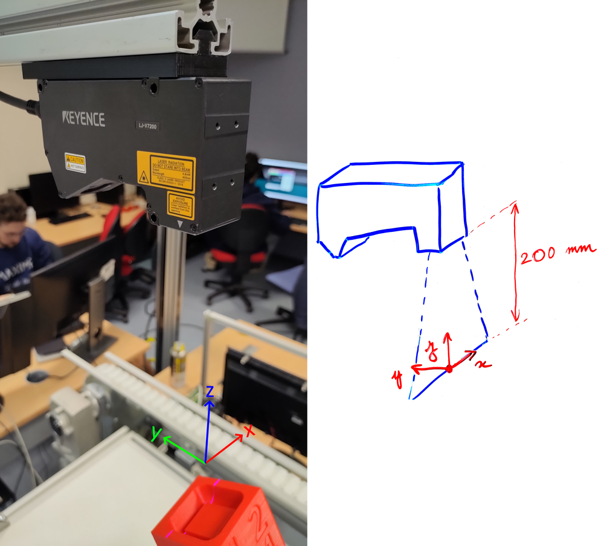
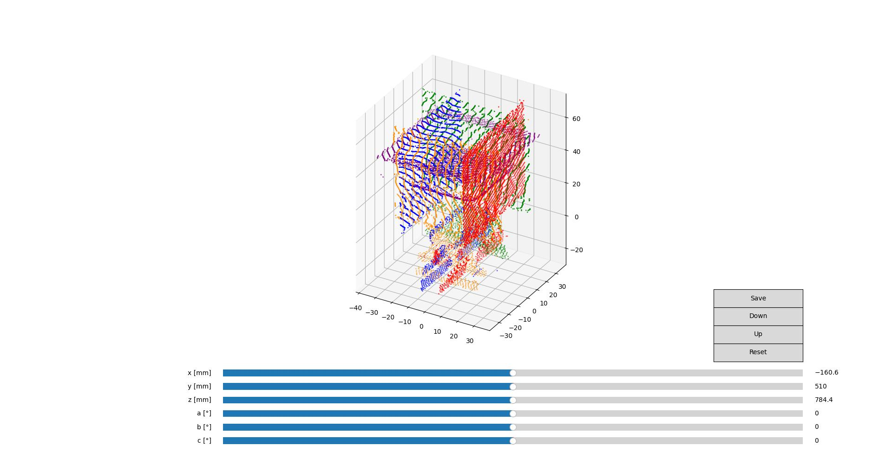
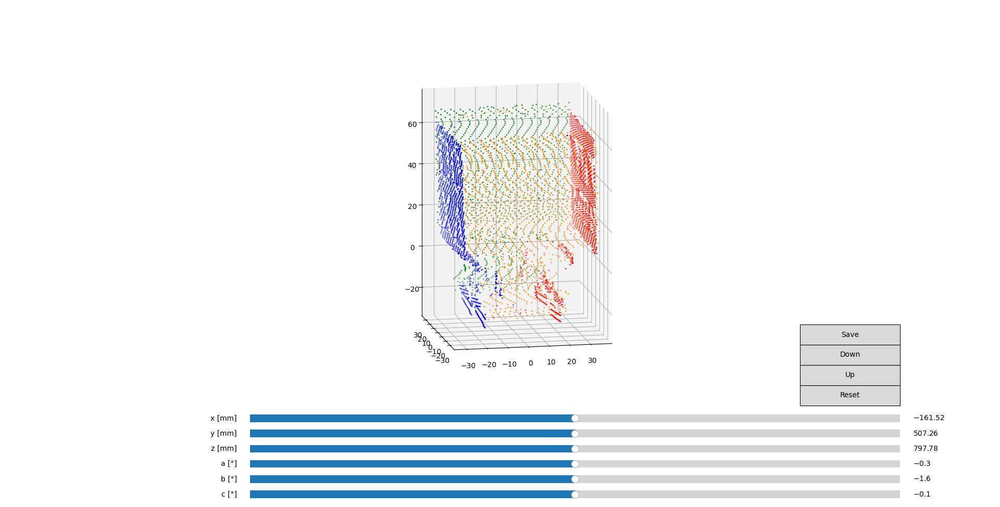

Profilométrie robotisée
=======================

Présentation
------------

Projet réalisé dans le cadre d'une UV projet à l'IMT Nord Europe qui consiste à scanner une pièce en 3D avec un robot Kuka et un profilomètre Keyence. Le but étant de détecter de potentielles imperfections sur des pièces imprimées en 3D.

A terme, tout doit passer par python : synchronisation avec le robot, démarrage des mesures et récupérations des données du profilomètre, assemblage des données et reconstitution d'un modèle 3D, détection des défauts, etc. Nous avons donc besoin de plusieurs briques de programme élémentaires, à commencer par des API de communication avec le robot et le profilomètre.

Le robot devra prendre les pièces à scanner sur le convoyeur, et présenter ses différentes faces au profilomètre. Un script python se charge pendant ce temps de récupérer les données du profilomètre et de reconstituer le cube.

Table des matières
------------------

- [API Kuka](#api-kuka)
- [API Profilomètre](#api-profilomètre)
- [Utilisation du profilomètre](#utilisation-du-profilomètre)
- [Visualisation & modélisation 3D](#visualisation--modélisation-3d)
- [Utilisation de Meshlab](#utilisation-de-meshlab)
- [Transformations 3D](#transformations-3d)
- [Script principal](#script-principal)
- [Protocole de calibration](#protocole-de-calibration)
- [Protocole en cas de changement de robot](#protocole-en-cas-de-changement-de-robot)
- [Annexes](#annexes)
- [Limitations connues et perspectives d'amélioration](#limitations-connues-et-perspectives-damélioration)

Installation
------------

Commencez par cloner le dépôt git :
```bash
git clone https://github.com/maximebohrer/profilometrie_robot.git
```
ou téléchargez le dossier à partir de Github. Nous recommandons l'utilisation de Visual Studio Code avec l'extension python pour ouvrir ce dossier, naviguer entre les scripts et les exécuter.

Voici les modules nécessaire pour faire fonctionner l'ensemble du projet. Attention : pour `open3d`, les versions récentes de python ne fonctionnent pas. Nous recommandons la version `3.9`.
```bash
pip install numpy
pip install pyserial
pip install matplotlib
pip install open3d
```

Lisez ensuite cette documentation, et en particulier la partie [Script principal](#script-principal) qui explique comment lancer le projet.

API Kuka
--------

Le robot Kuka reçoit les commandes envoyées depuis python grâce à une communication série. Côté robot, un programme KRL lit les données reçues sur le port série, les interprète, et effectue les mouvements demandés. Côté python, le fichier `pykuka.py` contient toutes les fonctions nécessaires à l'utilisateur pour envoyer des commandes au robot. Ce fichier pourra ensuite être importé dans le scipt principal, et peut aussi être réusilisé dans d'autres projets :
```python
import pykuka as kuka
```

- La fonction `initialize(port)` doit être appelée avant toutes les autres. Elle sert à initialiser la communication série : par exemple `initialize("COM1")`.
- La fonction `read_3964R_pose` est à utiliser lorsque la fonction `SEND` est appelée dans le programme du robot. Elle sert à récupérer et décoder la position renvoyée par le robot.
- La fonction `send_3964R_single_char` est à utiliser lorsque la fonction `READ_CHAR` est appelée dans le programme du robot. Elle sert à envoyer un caractère au robot.
- La fonction `send_3964R_single_double` est à utiliser lorsque la fonction `READ_DOUBLE` est appelée dans le programme du robot. Elle sert à envoyer un nombre décimal au robot.
- La fonction `go_to_pose` est à utiliser uniquement si le programme `PC2KUKA`, qui permet d'interpréter des commandes de mouvement, tourne sur le robot. Elle sert à envoyer au robot l'ordre d'atteindre une position.
- La fonction `get_pose` est à utiliser uniquement si le programme `PC2KUKA`, qui permet d'interpréter et de répondre à des commandes, tourne sur le robot. Elle sert à demander au robot d'envoyer sa position actuelle.
- La fonction `finalize` doit être appelée à la fin du script. Elle sert à terminer la communication série.

Ce fichier et ces fonctions peuvent être réutilisées dans d'autres projets utilisant un robot KUKA.

NB : A l'origine, il était prévu d'utiliser le programme `PC2KUKA` du robot afin de le rendre esclave de python. Toutes les positions à atteindre auraient alors été envoyées depuis le programme python. Cependant, le choix du type de mouvement, de la vitesse, etc. n'étaient pas possibles sans complexifier de manière importante le programme et la communication entre le robot et python. Le choix de la configuration des axes, pour un point donné, n'était également pas possible, ce qui s'avère génant pour les mouvements complexes que nous devons effectuer. Nous avons donc décidé de créer un programme robot propre à notre projet en y mettant les points en dur, et en gardant les fonctions de communications pour l'envoi de la position et de caractères pour la synchronisation avec python, comme vous le verrez dans le [script principal](#script-principal). Ceci a également l'avantage de pouvoir utiliser les différentes bases du robot, et d'en créer une pour le profilomètre, ce qui facilitera son déplacement si nécéssaire : seule l'origine du repère doit être reprise, et les points s'adapteront tout seuls. Voir la partie [Protocole de calibration](#protocole-de-calibration).

API Profilomètre
----------------

La communication avec le profilomètre s'effectue grâce à au fichier `LJV7_IF.dll` fourni par Keyence. Ce type de DLL étant habituellement prévu pour être utilisé dans des langages bas niveau comme le C ou le C++, un fichier `pyprofilo.py` permettra de simplifier les appels aux fonctions du DLL en s'y interfaçant grâce au module `ctypes`. Ce dernier permet de travailler avec tous les types du langage C en python, de charger des fichiers DLL, et d'appeler les fonctions qui s'y trouvent, après un travail de convertion de types, de gestion de structures C, etc. Ce fichier pourra ensuite être importé dans le scipt principal, et peut aussi être réusilisé dans d'autres projets :
```python
import pykeyence as profilo
```

- La fonction `Initialize(debug)` permet d'initialiser le DLL. Elle doit être appelée avant toutes les autres. Mettre `débug` à `True` pour afficher des messages de débuggage dans le terminal.
- La fonction `EthernetOpen(deviceID, ipAddress, port)` permet de se connecter au profilomètre. Renseigner l'adresse IP (chaîne de charactères) et le port. Dans cette fonction et dans celles qui suivent, `deviceID` doit être mis à 0.
- La fonction `GetProfileAdvance(deviceID)` permet de récupérer un seul profile lorsque le profilomètre n'est pas en mode batch. La fonction renvoie un nuage de points de la forme [[x, y, z], [x, y, z], ...] (y étant toujours nul puisqu'on a qu'un seul profile).
- Les fonctions `StartMeasure(deviceID)` et `StopMeasure(deviceID)` permettent de démarrer et d'arrêter la prise de profils lorsque le profilomètre est en mode batch. Les profils sont pris les uns après les autres, à interval régulier, ou manuellement en utilisant la fonction `Trigger(deviceID)` (voir la partie [utilisation du profilomètre](#utilisation-du-profilomètre))
- La fonction `GetBatchProfileAdvance(deviceID, nbProfiles, yStep)` permet de récupérer les profils pris pendant une mesure en mode batch. `nbProfiles` permet de préciser le nombre maximal de profils à récupérer. Le nombre de profils effectivements récupérés peut être inférieur. `yStep` est la distance entre deux profils successifs (la pièce se déplace dans la direction y). Elle doit être calculée en fonction de la fréquence de prise des profils du profilomètre et la vitesse de déplacement de la pièce devant le profilomètre. Cette fonction est prévue pour être utilisée uniquement en mode continu. Elle peut être adaptée si besoin pour fonctionner différemment.
- Les fonctions `CommClose(deviceID)` et `Finalize()` doivent être appelées à la fin du script. Elles servent à fermer la communication avec le profilomètre et à désinitialiser le DLL.

D'autres fonctions du profilomètre pourraient être implémentées dans ce fichier en fonction des besoins, notamment tout ce qui concerne la communication haute vitesse. Toutes les informations nécessaires à ce type de développement sont disponibles dans la documentation de la librairie du profilomètre `doc/LJ-V7000 Communication Library.pdf`.

Utilisation du profilomètre
---------------------------

Voici quelques points importants pour comprendre le fonctionnement du profilomètre et le configurer :

Le logiciel `LJ Navigator` permet de configurer le profilomètre, d'afficher et d'enregistrer des profils. 
Un profil est une ligne prise par le laser du profilomètre. Sur ce modèle de profilomètre, une ligne fait 800 points. Chaque point correspond à une abscisse (x) et à une hauteur (z) mesurée par le profilomètre.
Un bouton `Démarrer affichage` permet d'afficher ce que le profilomètre voit. Le logiciel affiche alors la même chose que l'écran du profilomètre.
Un lot de profils (batch) est une suite de plusieurs profils individuels. La pièce se déplace devant le profilomètre lors de la prise des profils, transformant ainsi le nuage de point 2D d'un profil individuel à un nuage de points 3D (une coordonnée y vient donc s'ajouter). Le profilomètre dispose d'un mode batch qui réalise cette fonction.

Le profilomètre a deux modes principaux de fonctionnement :
- le mode normal qui permet de prendre des profils individuellements (voir la fonction `GetProfileAdvance` de la partie [API Profilomètre](#api-profilomètre)).
- le mode batch qui permet de faire des lots de profils. Ce mode nécéssite de choisir une fréquence d'échantillonage (fréquence à laquelle les différents profils du lot sont pris), un pas (distance entre les profils, qui dépend de la fréquence d'échantillonage et de la vitesse de la pièce sous le profilomètre) et un nombre maximal de profils à prendre. En mode batch, un enregistrement doit être déclenché (bouton `démarrer lot`, fonction `StartMeasure`), puis arrêté manuellement (bouton `arrêter lot`, fonction `StopMeasure`) ou automatiqument (lorsque le nombre de profils demandé est atteint). Attention, en mode batch, l'affichage n'est actif que pendant l'enregistrement, que ce soit sur l'écran du profilomètre ou sur le logiciel. Pendant l'enregistrement, des profils sont pris en lot, puis peuvent être enregistrés (fonction `GetBatchProfileAdvance`). Plusieurs modes d'acquisition sont possibles pour les lots :
    - le mode continu, qui prend des profils à intervalles réguliers avec une fréquence donnée, mais qui nécéssite d'avoir une vitesse de la pièce parfaitement connue pour la reconstituer proprement en 3D. C'est ce mode qui sera utilisé avec le robot.
    - le mode externe, qui permet de déclencher la prise de chaque profil manuellement (fonction `Trigger`).
    - le mode codeur, qui permet de déclencher la prise de chaque prodil sur les changements du codeur incrémental externe qui peut être branché au profilomètre. Ceci est utile si c'est un axe linéaire muni d'un codeur qui fait bouger la pièce devant le profilomètre.

Tous ces paramètres (mode batch, fréquence, pas, nombre de profils) peuvent être régler grâce au bouton `réglage direct`.

Utilisation du profilomètre ----> à fusionner avec la partie précédente
-----------------------------

Pour configurer le profilomètre Keyence LJ-V7080, on utilise le logiciel `LJ Navigator`. Voici les différentes étapes pour configurer correctement le profilomètre :
- Connectez le profilomètre à l'ordinateur via un câble USB et allumez le profilomètre.
- Ouvrez `LJ Navigator`.
- Dans la fenêtre `Liste de périphériques`, vérifiez que le profilomètre est bien détecté. Si le profilomètre n'apparaît pas, vérifiez la connexion internet ou réinstallez les drivers du profilomètre.
- Cliquez sur le bouton `Connexion` pour se connecter au profilomètre. Si la connexion échoue, vérifiez que le profilomètre est bien allumé et qu'il est connecté au même réseau.
- Dans la fenêtre `Réglage rapide`, vérifiez que les paramètres de base sont corrects (par exemple la vitesse de déplacement du profilomètre). Ces paramètres peuvent être modifiés en cliquant sur le bouton `Réglage direct`.

Dans la fenêtre `Réglage déclench.`, réglez les paramètres de mesure du profilomètre. Les paramètres sont les suivants :
- `Mode de déclenchement` : Choix du mode de mesure (Voir partie [Utilisation du profilomètre](#utilisation-du-profilomètre))
- `Fréquence d'échantillonnage` : c'est la fréquence à laquelle les mesures sont effectuées. Plus cette fréquence est élevée, plus la mesure sera précise mais plus le temps de mesure sera long. La fréquence d'échantillonnage doit être choisie en fonction de la précision désirée et du temps de mesure acceptable.
- `Pas de mesure` : Cela correspond à la distance réelle entre deux points de mesure consécutifs, utilisée pour mettre à l'échelle le nuage de points 3D obtenu. Ce paramètre doit être déterminé avec précision pour garantir la précision de la reconstruction 3D de la pièce.
- `Nombre de points de mesure` : c'est le nombre de points de mesure qui seront pris. Plus ce nombre est élevé, plus la mesure sera précise mais plus le temps de mesure sera long. Le nombre de points de mesure doit être choisi en fonction de la précision désirée et du temps de mesure acceptable. Dans le cas de notre projet il faut le prendre plus grand que nécessaire, car la mesure sera arrêtée manuellement dans tous les cas avant d'atteindre le nombre de points de mesure.

Dans la fenêtre `Réglage image.`, réglez les paramètres d'image du profilomètre. Les paramètres sont les suivants :
- `Mode de réflexion` : Permet d'ajuster les paramètres du laser du profilomètre de sorte à mieux mesurer les refiefs. 
- `Optimiser réglages` : Le logiciel détermine une succession de réglages possibles afin d'optimiser le rendu de l'image. 
- Enfin, on peut accéder à d'avantages de réglages en cliquant sur `Aller au regl. avancé`. On y trouve des paramètres de `plage de mesure :` c'est la plage de mesure en hauteur et en largeur que le profilomètre peut mesurer. Elle doit être choisie en fonction de la hauteur des pièces à mesurer.

On trouve finalement des options permettant d'appliquer des `filtres de traitement` dans l'onglet `Profil`, mais nous ne l'utilisons pas.

Dans la fenêtre `Mesure`, cliquez sur le bouton `Démarrer affichage` pour afficher les mesures en temps réel. Les mesures seront affichées sur l'écran du profilomètre et dans la fenêtre `Affichage` de `LJ Navigator`.

- Cliquez sur le bouton `Démarrer lot` pour commencer la mesure en mode lot. Les mesures seront prises en continu jusqu'à ce que le nombre de points de mesure soit atteint ou que l'utilisateur arrête la mesure manuellement en cliquant sur le bouton `Arrêter lot`.

- Une fois la mesure terminée, les données peuvent être enregistrées en cliquant sur le bouton `Enregistrer`. Les données peuvent être enregistrées dans différents formats, notamment `CSV, TXT, DAT, BMP, JPEG, TIFF`. Ce processus est complètement automatisé dans le [script principal](#script-principal) grâce à l'[API du profilomètre](#api-profilomètre).

Visualisation & modélisation 3D 
-------------------------------

Le fichier `Traitement faces.py` permet de traiter et d'analyser un nuage de point en format `txt` dont les 3 coordonnées ont déjà été créées. Il utilise la bibliothèque `Open3D` pour charger et filtrer les données brutes, puis calcule les coins et les faces du cube correspondant à l'objet. Il affiche ensuite les informations sur chaque face, telles que la longueur de chaque côté, l'aire de la face et sa rugosité. Le fichier contient également une fonction pour enregistrer les coordonnées des coins du cube dans un fichier texte, ainsi qu'un code pour afficher le modèle 3D du cube dans une fenêtre `matplotlib`. Les utilisateurs peuvent donc facilement adapter ce fichier à leur propre projet en modifiant les paramètres de filtrage ou en ajoutant des fonctionnalités supplémentaires. 

Cependant, si vous souhaitez directement ouvrir un nuage de points au format `csv`, vous devrez d'abord créer les 2 coordonnées manquantes à partir du numéro des colonnes et des lignes, puis les mettre à l'échelle en fonction des paramètres sélectionnés.

Le fichier `Traitement face` permet aussi de réduire le bruit du nuage de point. Le nuage de point traité est enregistré dans l'arborescence suivante, en format `txt` : `Data/Debug/nuage_filtered_outliers_removed_30_2.txt`.

Vous pouvez ensuite charger ce nuage de point dans un logiciel comme `Meshlab` afin de modéliser les faces du cubes.

Utilisation de Meshlab
----------------------

Le script principal génère un fichier par cube scanné. Ces nuages de points peuvent ensuite être importés, visualisés et traités dans Meshlab.

- Importation du nuage de points dans `Meshlab` :
Dans `Meshlab`, ouvrez le nuage de points traité enregistré précédemment au format `.txt`. Pour cela, allez dans le menu `File` et sélectionnez `Open...`.

- Calcul des normales :
Les normales sont des vecteurs perpendiculaires à chaque point du nuage de points. Elles sont nécessaires pour la méthode de `ball pivoting`. Pour calculer les normales, allez dans le menu `Filters` > `Compute Normals for Point Sets`. Une fenêtre apparaîtra vous permettant de sélectionner les options de calcul. Choisissez `Weighted Average` pour la méthode de calcul des normales et `10` pour le rayon de recherche. Cliquez ensuite sur `Apply`.

- Réduction du bruit :
Pour améliorer la qualité de la modélisation, vous pouvez réduire le bruit du nuage de points en allant dans le menu `Filters` > `Cleaning and Repairing`. Choisissez l'option `Cleaning: Planar Faces` et sélectionnez une valeur de seuil adaptée à votre nuage de points. Cliquez ensuite sur `Apply`.

- `Ball Pivoting` :
La méthode de `ball pivoting` permet de reconstituer une surface à partir d'un nuage de points en reliant les points qui sont à proximité les uns des autres. Pour utiliser cette méthode, allez dans le menu `Filters` > `Remeshing, Simplification and Reconstruction` > `Ball Pivoting`. Sélectionnez les options suivantes :
`Max Radius` : une valeur adaptée à votre nuage de points
`Min Angle` : une valeur adaptée à votre nuage de points
`Max Distance` : une valeur adaptée à votre nuage de points
`Cleaning` : cochez la case `Enable` pour supprimer les triangles inutiles et améliorer la qualité de la surface.
Cliquez ensuite sur `Apply`.

- Remplissage des trous :
Si le nuage de points contient des trous, vous pouvez les remplir en utilisant la méthode de `ball pivoting`. Pour cela, allez dans le menu `Filters` > `Remeshing, Simplification and Reconstruction` > `Close Holes`. Sélectionnez les options suivantes :
`Max Hole Size` : une valeur adaptée à votre nuage de points
`Self Intersection` : cochez la case `Enable` pour éviter les intersections entre les faces.
`Use Vertices` : cochez la case `Enable` pour créer de nouveaux points dans les trous.
`Respect Cutting` : cochez la case `Enable` pour éviter de couper les bords de la surface existante.
Cliquez ensuite sur `Apply`.

Exportation du modèle :
Une fois la surface du cube reconstituée et les trous remplis, vous pouvez exporter le modèle en allant dans le menu `File` > `Export Mesh As...`. Choisissez le format d'exportation souhaité (par exemple `.obj`) et enregistrez le fichier.
En utilisant cette méthode de `ball pivoting`, vous pouvez facilement modéliser les faces d'un cube à partir d'un nuage de points dans `Meshlab`.

Transformations 3D
------------------

Le fichier `transformations.py` contient des fonctions permettant de faire des changements de base en robotique. Des matrices de transformations homogènes sont utilisées. Ce fichier pourra ensuite être importé dans le scipt principal, et peut aussi être réusilisé dans d'autres projets :
```python
import transformations as tf
```

La fonction `get_htm` permet de calculer une matrice de transformation homogène à partir à partir de 6 paramètres x, y, z, a, b, c qui représentent la position et l'orientation d'une base B dans une base A. Cette matrice permettra ensuite de convertir des points dont les coordonnées sont exprimées dans la base B aux mêmes points dont les coordonnées sont exprimées dans la base A. Cette fonction utilise des matrices `numpy`, qui peuvent être multipliées entres elles et inversées. Inverser une matrice permet de passer de la base A à B au lieu de passer de la base B à A. Multiplier des matrices entres elles permet d'enchainer les changements de base. La dernière matrice du produit correspond au premier changement de base.

La fonction `apply_htm` prend en argument une matrice de transformation homogène et une liste de points, et applique la transformation. Les points ne peuvent en effet pas être multipliés directement à la matrice, il faut lui ajouter une 4ème coordonnée, et les exprimer sous forme de matrice colonne. Cette fonction se charge de ceci. Les points doivent être passés à la fonction sous la forme d'un tableau `numpy` de la forme [[x, y, z], [x, y, z], ...].

Attention : les paramètres de rotation a, b, et c ne signifient pas toujours la même chose pour les différents modèles de robot. Pour que le projet fonctionne, il faut être sûr du calcul de la matrice de rotation. Par exemple, pour le robot utilisé, la matrice de rotation est `rotation_matrix = Rz(a) * Ry(b) * Rx(c)`, c'est-à-dire qu'un point est décrit par une rotation autour de x d'angle c, puis autour de y d'angle b, puis autour de z d'angle a, puis par la translation x, y, z. D'autres conventions existent cependant, comme la convention ZYZ (`rotation_matrix = Rz(a) * Ry(b) * Rz(c)`). Cette expression, qui se trouve dans la fonction `get_htm`, est donc à modifier en fonction du robot utilisé, et à déterminer à partir de sa documentation ou en faisant différents essais. Pour savoir si la matrice est correcte, suivre ce protocole :
- Créer une nouvelle base dans le robot avec une position et une orientation aléatoire.
- Relever les paramètres x, y, z, a, b, c de cette base, et les utiliser pour créer une matrice de transformation homogène avec `get_htm`. Cette matrice permettra donc de passer des coordonnées de cette base aux coordonnées de la base world du robot.
- Ammener l'outil à une position et une orientation aléatoire.
- Affichier sur le robot et relever les coordonnées x, y, z de ce point dans la base nouvellement créée, et les exprimer dans la base world grâce à la fonction `apply_htm`.
- Afficher sur le robot les coordonnées de ce même point, mais dans la base world (base principale, base 0) et comparer avec les résultats obtenus. Si tout correspond, alors la matrice de rotation est juste. Sinon, en tester une autre.

Script principal
----------------

Le fichier `script_principal.py` communique simultanément avec le robot et le profilomètre pour réaliser le scan des pièces. Le programme `PROJET_PROFILO` du robot cherche les cubes sur le convoyeur et les passe devant le profilomètre. Le programme du robot doit être lancé de préférence avant le script python.

### Prérequis et lancement

- Un dossier `data` doit être créé
- Le profilomètre doit être en marche et [correctement configuré](#du-côté-du-profilomètre)
- Un câble série doit relier le robot et l'ordinateur sur lequel le script python sera exécuté
- Le port série spécifié lors de l'initialisation du module `pykuka` doit être le bon (généralement `COM1` si le port série physique de l'ordinateur est utilisé)
- Le robot doit être en marche et le [programme `PROJET_PROFILO`](#du-côté-du-programme-du-robot) doit tourner en automatique à une vitesse de 100% (uniquement après avoir été testé en faible vitesse !)
- Les [bibliothèques python](#installation) nécesaires doivent être installées
- Les variables `VITESSE_ROBOT` et `FREQUENCE_PROFILO` doivent correspondre respectivement à la vitesse linéaire du robot lors du movement de scan et à la fréquence d'échantillonnage du profilomètre.

Vous pouvez ensuite lancer le script python
```bash
python script_principal.py
```

### Du côté du script python

Le [module pykuka](#api-kuka) est utilisé pour communiquer par liaison série avec le robot. Des caractères et des nombres peuvent par exemple être échangés pour obtenir la position du robot, ou synchroniser le script python avec le programme robot.

Le [module pykeyence](#api-profilomètre) est utilisé pour communiquer avec le profilomètre sur le réseau.

Le [module transformations](#transformations-3d) sert à appliquer des changements de base sur un nuage de points.

Grâce à ces modules, la structure du script est très simple à comprendre. Le script demande à l'utilisateur de confirmer qu'un cube est présent sur le convoyeur, avant d'envoyer le signal de départ au robot. Cette étape pourrait être remplacé par un capteur de présence relié au robot. Pour chaque face scannée du cube, le robot envoie un signal lors du début du scan, après quoi python fait démarrer une mesure sur le profilomètre. Le robot envoie à nouveau un signal lorsque le scan est terminé, après quoi python arrête la mesure sur le profilomètre, et récupère les profils. Un changement de base est effectué sur le nuage de points renvoyé par le profilomètre pour l'exprimer dans le repère outil, ce qui a pour effet de reconstituer le cube. Voir la partie [calibration](#protocole-de-calibration) pour plus d'informations. Les points sont écrits dans le fichier `data/nuageX.txt` pour traitement ultérieur, et les points avant transformation sont écrits dans `data/nuage_brut.txt` pour pouvoir être utilisés lorsqu'une calibration est nécessaire. Tout ceci est répété en boucle.

Voir le fichier `script_principal.py` et les commentaires présents pour plus d'informations et pour voir le fonctionnement du script en détails.

Si, lors de la visualisation des fichiers `data/nuageX.txt`, le cube n'est pas reconstitué correctement, une [calibration](#protocole-de-calibration) est nécessaire.

### Du côté du programme du robot

Le programme robot est tout à fait standard : les points ont été pris avec le robot et sont en dur dans le programme. Le robot va d'abord chercher un cube, puis le pose et l'attrape dans l'autre sens, puis effectue le scan des différentes faces. Après le scan des faces, le robot attend le signal du python qui détermine si le cube est conforme ou non, avant de le reposer sur le tapis ou le jeter au rebut. Tout ceci est répété en boucle.

Les lignes
```
; go to points and take profiles
PTP P2  Vel= 20 % PDAT19 Tool[3]:pince Base[3]:profilometre
R1 = PRENDRE_PROFILE(HANDLE, SR_T, SC_T, MR_T, IN_CHAR)
PTP P6  Vel= 20 % PDAT20 Tool[3]:pince Base[3]:profilometre
R1 = PRENDRE_PROFILE(HANDLE, SR_T, SC_T, MR_T, IN_CHAR)
; etc...
```
sont responsables du scan du cube : seules deux lignes sont nécessaires à scanner une face :
- La commande `PTP` qui ammène le robot à sa position de départ. Attention : Le mouvement doit obligatoirement être effectué avec l'outil `pince` et dans la base `profilomètre`, afin que dans la suite, la position envoyée par le robot soit celle de la `pince` dans le repère `profilometre`.
- l'appel à la fonction `PRENDRE_PROFILE` qui envoie l'information de début et de fin de scan à python ainsi que la position initiale du robot, effectue le mouvement linéaire parallèlement au profilomètre, et attend le signal de python indiquant la fin de la réception des données du profilomètre, avant de passer à la face suivante. La vitesse linéaire écrite en dur dans cette fonction doit être reportée dans la variable `VITESSE_ROBOT` du script python, pour permettre le calcul de la distance entre chaque profil.

Pour la synchronisation avec python et la remontée d'informations, les lignes
```
; wait GO signal from PC
WHILE (IN_CHAR <> 71)
   R1 = RECV_CHAR(HANDLE, SR_T, SC_T, MR_T, IN_CHAR)
ENDWHILE
```
servent à attendre un caractère de python, ici le GO (71), les lignes
```
; send DONE
R1 = SEND_CHAR(HANDLE, SR_T, SC_T, MR_T, 35)
```
servent à envoyer un caractère à python, ici le DONE (35), et les lignes
```
; send starting position to PC
R1 = SEND(HANDLE, SR_T, SC_T, MR_T)
```
servent à envoyer à python la position du robot, qui est utile pour appliquer les changements de base.

Voir le programme `PROJET_PROFILO` du robot et les commentaires présents pour plus d'informations et pour voir son fonctionnement en détails.

### Du côté du profilomètre

Le profilomètre doit être en mode batch et en mode continu. Les réglages que nous avons utilisé sont une fréquence de 100 Hz (pour une vitesse de 0.0130 m/s du robot) et 1000 points. Voir la partur [Utilisation du profilomètre](#utilisation-du-profilomètre) pour effectuer ces réglages.
La fréquence d'échantillonnage du profilomètre doit être reportée dans la variable `FREQUENCE_PROFILO` du script python, pour permettre le calcul de la distance entre chaque profil.

Protocole de calibration
------------------------

La reconstitution du scan 3D à partir des différents profils repose sur le fait que la base "profilometre" du robot soit parfaitement alignée avec la base du nuage de points renvoyé par le profilomètre. En effet, si les points renvoyés par le profilomètre peuvent être considérés comme étant dans la base "profilometre" du robot (ce qui est le cas si les deux bases sont parfaitement alignées), alors un changement de base peut permettre d'exprimer ces points dans le repère de l'outil. La pièce scannée étant fixe dans le repère de l'outil, passer tous les profils dans la base de l'outil permet automatiquement de reconstituer la pièce. Ces changements de bases sont fait en Python grâce aux coordonnées (de l'outil pince dans le repère profilometre) renvoyés par le robot avant chaque profil.

Le repère du nuage de points renvoyé par le profilomètre est représenté dans cette image. NB : son origine se trouve à environ 200 mm de la sortie du laser du profilomètre, mais cela peut varier en fonction du réglage du zéro du profilomètre.



Le but est donc de placer le repère "profilometre" du robot au point (position et orientation) indiqué sur l'image. Plusieurs méthodes sont possibles :
1. Utiliser la méthode des 3 points pour définir une base (Service > Mesurer > Base > Méthode des 3 points). Le robot demande alors de se placer à l'origine, puis sur l'axe x, puis sur l'axe y, et le repère est établi.
2. Se rendre à l'origine du repère de l'image, relever la position du robot et l'entrer manuellement dans dans les paramètres x, y, z de la base (Service > Mesurer > Base > Entrée numérique). Si vous placez le profilomètre dans la même configuration que nous, le repère du nuage de points est orienté de la même façon que le repère du robot. Les paramètres a, b, c peuvent donc être mis à 0. Si le profilomètre est mis dans une autre orientation, ces paramètres devront être adaptés.

Le repère "profilometre" du robot est maintenant à peu près au même endroit que le repère du nuage de points du profilomètre. Les coordonnées des points du nuage de points renvoyé par le profilomètre correspondent donc à peu près aux coordonnées des points du cube dans la base "profilometre" du robot (lorsque le robot est à sa position du début de scan). Il faut maintenant ajuster cette base pour l'aligner parfaitement sur la base du nuage de points. Un assistant de calibration permet de faire cela.
- réaliser un premier scan à l'aide du [script principal](#script-principal). Ceci génèrera un fichier `data/nuage_brut.txt` qui contient, pour chaque face scannée du cube, le nuage de points renvoyé par le profilomètre (sans aucune transformation) et la position de départ du robot.
- Lancer le script `calibration_assistant.py`. Cet assistant refait en direct les mêmes transformations que `script_principal.py` en ajoutant la possibilité de faire varier les paramètres de la base "profilomètre" et de visualiser les effets que ceci aurait.
- Entrer les paramètres x, y, z, a, b, c actuels de la base "profilometre" (Service > Mesurer > Base > Entrée numérique).
- Une fenêtre s'ouvre, dans laquelle des sliders permettent de faire varier ces paramètre, et de visualiser en direct l'effet que le changement aurait sur les transformations et la reconstitution du cube.
- En jouant sur ces 6 valeurs, faire en sorte que le cube soit parfaitement reconstitué.
- Fermer la fenêtre, les 6 nouveaux paramètres s'affichent dans le terminal.
- Entrer ces nouvelles valeurs dans la base "profilometre" du robot (Service > Mesurer > Base > Entrée numérique).
- relancer un scan avec le script principal. Visualiser le cube obtenu : il devrait être reconstitué correctement. Cette procédure peut être à nouveau répétée si ce n'est pas le cas.




NB : si le cube est impossible à reconstituer, cela peut vouloir dire que le robot est mal calibré. En effet, les positions de début de scan renvoyées seraient alors fausses, emêchant de faire les bonnes transformations. Une calibration des 6 axes du robot est alors nécessaire.

Entrer les nouvelles valeurs dans la base "profilometre" du robot permet de faire deux choses :
- les points du nuage de points correspondent maintenant parfaitement aux points du cube dans la base profilometre du robot. Le script principal n'a donc pas de transformation à faire pour passer de l'une à l'autre.
- L'orientation du repère étant réajustée, le mouvement de scan du robot est maintenant effectué parfaitement parallèlement au profilomètre.

Protocole en cas de changement de robot
---------------------------------------

Pour continuer d'utiliser le projet avec un robot différent, deux étapes sont nécéssaires :
- S'assurer que la matrice de rotation est calculée correctement, ou modifier cette dernière. Pour cela, suivre le protocole décrit dans la partie [Transformations 3D](#transformations-3d).
- Effectuer une calibration du système en suivant le protocole de la partie [Protocole de calibration](#protocole-de-calibration).

Annexes
-------

Le dossier `3d_models` contient les modèles 3D utilisés ou créés durant le projet : les cubes que nous scannons, un cube modifié avec des motifs supplémentaires, les nouveaux mors de la pince, la pièce d'adaptation de la pince sur l'organe terminal du robot.

Le dossier `doc` contient les documentations tierces importantes.

Le dossier `code_robot` contient des sauvegardes des programmes du robot Kuka.

Limitations connues et perspectives d'amélioration
--------------------------------------------------

### Calibration automatique

La [calibration](#protocole-de-calibration) du système peut être automatisée : En trouvant une fonction qui atteindrait un minimum lorsque le cube est reconstitué, un [algorithme de descente de gradiant](https://fr.wikipedia.org/wiki/Algorithme_du_gradient) peut être utiliser pour trouver les 6 paramètres x, y, z, a, b, c qui minimisent cette fonction. On pourrait par exemple demander à l'utilisateur de reconstituer à peu près le cube, puis l'algorithme pourrait trouver dans chaque face les sommets du cube. On peut ensuite calculer la distance entre les sommets de faces adjacentes qui sont sencés être confondus. La somme des carrés de ces différences constituerait une bonne fonction à minimiser : lorsque le cube est reconstitué, les sommets se touchent et la distance est nulle.

### Fluidité du mouvement linéaire du robot

La fluidité du robot actuel lors du déplacement linéaire devant le profilomètre n'est pas parfaite. Lors d'un déplacement horizontal, le robot "vibre" de haut en bas, ce qui laisse apparaitre des oscillations d'environ un dixième de millimètre sur le profil. L'utilisation d'un autre robot réglerait le problème, un essai avec l'UR5 l'a confirmé. On pourrait également essayer de trouver d'autres positions ou configurations d'axes du robot qui limiteraient le problème.

### Précision du placement du robot

Le robot dispose d'une très bonne répétabilité : lorsqu'on l'envoie deux fois au même point, il ira toujours exactement au même point. Par contre, son repère n'est pas parfait : le point auquel le robot pense être n'est pas exactement celui auquel il est vraiment. Ceci est vraisemblablement dû à la calibration de ses 6 axes. Lors des transormations du script principal, les faces ne sont donc pas forcément replacées exactement à l'endroit où elles sont sencées être. Cela se voit aussi dans l'assistant de calibration, où il est difficile d'obtenir un cube parfait en jouant avec les paramètres. Encore une fois, l'utilisation d'un autre robot réglerait le problème.

Ce problème pourrait aussi être contourné en introduisant une transformation supplémentaire par face, pour corriger l'erreur de positionnement du robot. Dans le script principal, ceci se traduirait par une liste de matrices de transformation homogène à appliquer successivement à chaque face scannée. L'inconvénient serait que si l'on change la position de départ du scan d'une face dans le robot, sa matrice devra aussi être actualisée. L'assistant de calibration devrait aussi être repensé pour permettre de régler ces matrice, et donc de bouger les différentes faces indépendamment. Mais ceci pourrait aussi être automatisé de la même façon que le premier point, sauf qu'il y aurait 5 * 6 paramètres de plus si l'on scanne 5 faces (un x, y, z, a, b, c de plus par face).

### Réglage à distance du profilomètre

Pour l'instant, le profilomètre doit être configuré à la main avant de lancer le script. Le DLL du profilomètre met cependant à disposition des fonctions permettant de changer cette configuration. Les réglages peuvent donc être effectués depuis python : voir par exemple la fonction `SetSetting_SamplingFrequency` du fichier `pykeyence.py`. D'autres peuvent être implémentées en suivant la documentation `doc/LJ-V7000 Communication Library.pdf`. Il peut être inréressant de les intégrer au script principal, de manière à pouvoir lancer le projet même si le profilomètre n'est pas bien configuré.

TODO List
---------

fusionner les 2 parties profilomètre
ENLEVER UN PARAMETRE DE TOUTES LES FONCTIONS GETBATCHPROFILEADVANCE